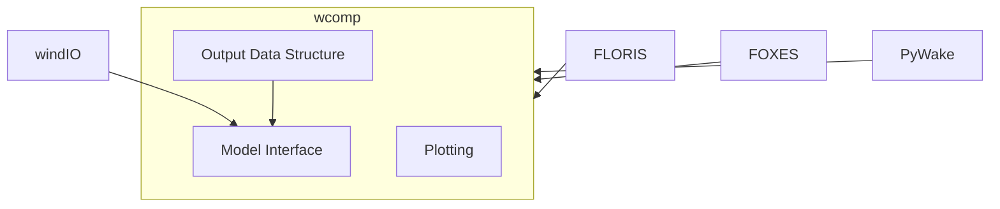

# wcomp - A framework for comparing steady-state wind turbine wake modeling software

`wcomp` is a Python-based framework for comparing the wind turbine and wind farm wake
calculations from a class of simulation software that typically have the following
characteristics:

- Python-based
- Low-fidelity, analytical models
- Research oriented

The objective is to provide a framework for characterizing the spread in implementations
and customizations of a common set of mathematical wake models. 

This framework and simple use cases were presented at the
2023 Wind Energy Sciences Conference in Glasgow, Scotland, by Rafael Mudafort.
The slides from this talk are available HERE, and a corresponding executable
notebook is here.

## Architecture and Design

The `wcomp` framework is meant to be simple and flexible. At it's core, it is three
district components:

1. A connection to the windIO interface for each integrated wake modeling software
2. A library of data structures to represent the results of a wake calculation
3. A library of plotting methods that couple with the included data structures

Any methods related to wind farm simulations or the calculation of related values
or statistics should exist in the wake modeling software packages themselves.
This framework should remain the point of the connection across this class of
software.

The architecture of this framework is outlined below. The integrated software
are dependencies of `wcomp`, but the source code is external. The `windIO` package
is used both to define the comparison cases and to load the input files.

TODO: See XX API documentation.

# Limitations
- Can only use 1 turbine type
    - Foxes calls the windio input by a hard coded name, so any additional turbine type will overwrite the previous definition
- windIO doesn't have a schema for model inputs, so these are currently hard coded in the code interfaces (WindIOCode-classes)
